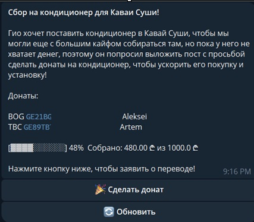

# Introduction

This service was necessary to organize donations to raise funds for the purchase of an air conditioner for a hobby club.

Since it was not possible to track transfers directly, there was a need for an administrator to whom the money would be sent. The administrator's tasks included confirming or rejecting transactions upon receipt of the money.

Thus, the service had to store the transactions themselves with their status and return the collected amount. Based on this, it was necessary to use an SQL table to store transactions, as well as a Telegram bot for convenient GUI interaction with users and the administrator. 

# Implementation

- All functionality is implemented in Python 3.12 in the app.py file.
- PostgreSQL based on the [Neon](https://neon.com/) was used as the database, communicating with it using the psycopg2 library.
- FastAPI framework with async routines was used to implement the server, which ensured the simplicity and almost instantaneous response of the Telegram bot.
- The service connected directly to the Telegram API using a webhook.

# Interface

In the main window, the user sees a welcome message, donation accounts, and the current fundraising status bar:

After that user can make a donation, writing down amount and confirm: 

 There is a validity check for amount.
Administrator (his ID has been set in environment variables) instantly receives a push notification, 
where he can reject or approve the transaction and update gathered sum on the status bar.
